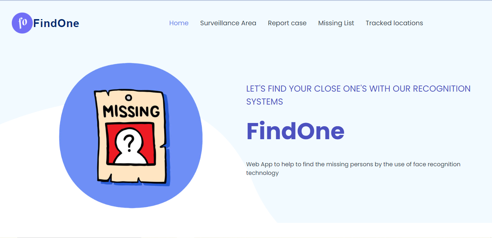
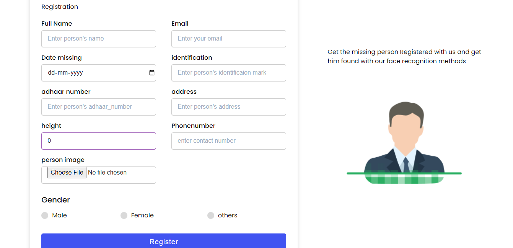
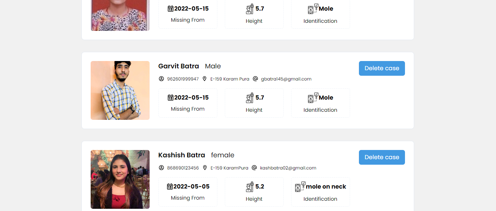
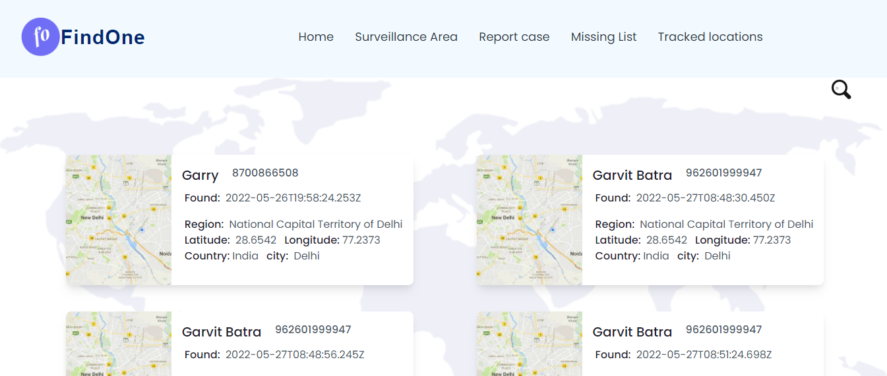
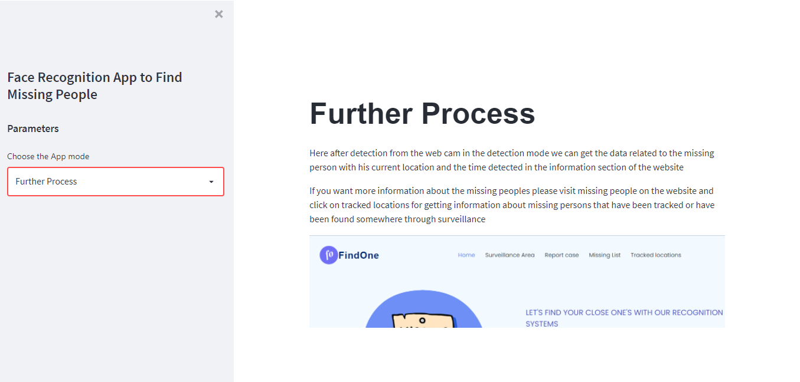
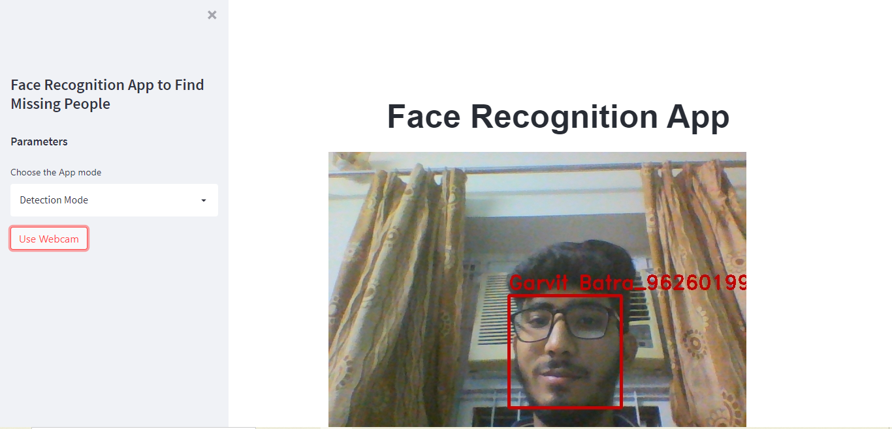
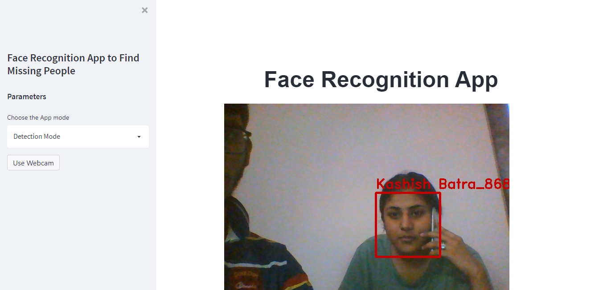
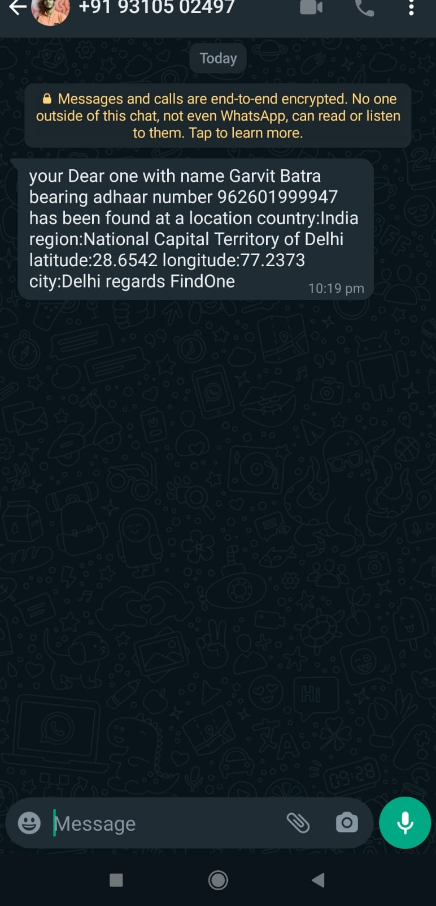

## Table of Contents
1. [General Info](#general-info)
2. [Live Demo](#live-demo)
3. [Technologies](#technologies)
4. [Installation](#installation)
5. [Features](#features)
### General Info
***
This web app is an online portal that enables users to register their close ones which are missing and provides interface to see their movement activities that has been tracked through our face recognition surveillance. It shows all the missing people with their images which has been reported by the stakeholder.  Agile Methodology was used for building this project. The best Agile practices adopted were :

* Proper Planning
* Keeping Product Backlog
* Maintaining a SPRINT Burndown and a Product Burndown.
* Adopting the concepts of relative estimation and velocity.

## Live Demo 
***
Project Link: ############

Demo Video: ###############

### Screenshots
* Home Page



* Sign Up

 

* Team's Meeting



* Chat System



* Chat System


* Chat System



* Chat System



* Chat System



* Chat System



## Technologies
***
A list of technologies used within the project:
* Face recognition
* Whatsapp API
* Node.js
* Express
* Open CV
* MongoDB
* React
* Tailwind CSS

## Installation
***
A little intro about the installation. 
```
$ git clone https://github.com/###########

```
In Node-js server MS
```
$ npm install
$ node index.js

```
In face_recognition 
```
$ pip install virtualenv
$ virtualenv <my_env_name>
$ source <my_env_name>/bin/activate
$ pip install -r requirements.txt
$ streamlit run main.py

```
In ms frontend 
```
$ npm install
$ npm start

```


## Features
***
FindOne features:
* Interactive UI to show missing people
* Real Time environment analysis to detect faces
* Quick and fast Node js backend to support quick response of user detection to database
* Less image degradation due to base64 transfer of image
* Easy to operate missing people data
* Sharing the Meeting Link
* Show Time Stamp when a person detacted
* Show accurate location of the person with longitude and latitude pointers
* Pop up Notification of Whatsapp to registered stakeholder mobile number within microseonds
* Leave Meeting
* Search all locations of particular person by adhaar card
## 